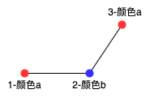
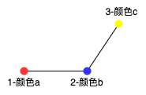

# 第 1 课 练习

今天的练习大部分取自这个[ZK Topic Sampler](https://learn.0xparc.org/materials/circom/prereq-materials/topic-sampler/)。

## ZKP 三色演示

访问并试用[交互式演示](pathname:///interactive/graph.html)。 这是我们在课堂上学习的三色示例的程序化版本。

* [x] 回答页面底部的练习 1。

**练习 1**： 目前，您只能选择相邻的节点对进行检查。 如果您可以选择任意节点对来检查，证明仍然是零知识吗？

答：不是零知识。对于任意一个图，假设我们现在是Verifier方，通过每次选择图中任意的两个节点，询问Prover它们的颜色，不断重复，如果能得到Prover对这个图的三色方案，这样就证明了这一过程不是零知识。首先我们确定我们要图色的三个颜色{a,b,c}，下图示例选择a=红色，b=蓝色，c=黄色。任意选择图中的一条边，涂上两个不同的颜色a与b，红色与蓝色。


图中肯定有节点与节点1或节点2相邻，假设图中有节点3与点2相邻（与节点1相邻也类似），现在想确定点3的颜色。由于点3与点2相邻，因此不可能为点2的颜色b（蓝色），点3的颜色只能是a（红色）或c（黄色）。


在与Prover交互时，我们选择点1与点3，由于Prover每轮会改变颜色排列，我们能获取的信息就是这两点的颜色是否相同。

(a)如果相同，则点3颜色=点1的颜色a(红色)。



(b)如果不同，即点3颜色不为点1颜色a（红色），由于与点2相邻，也不能为颜色b（蓝色），则只能是颜色c（黄色）。



通过这次交互，我们能唯一确定节点3的颜色。接着在下次与prover交互时，根据图的情况，如果有节点x与图中已确定的三点中任意一点y相邻，选择点x、与点y相邻节点，查看它们颜色是否相同，就能确定节点x的颜色。例如图中有节点x与点1相邻，就选择查看点x与点2颜色是否相同，如果相同，点x就是蓝色，如果不同，点x就是黄色。


以此种方式不断选择点与Prover交互，就能确定Prover的涂色方案。


**练习 2**： 当前用于置信度的方程是 1-(1/E)^n，其中 E 是图中的边，n 是运行试验的次数。 这是正确的等式吗？ 为什么没有先验？

答：不是正确的等式。正确的等式是$1-(1-\frac{1}{E})^n$。这里置信度就是我们有多大的概率相信Prover是知道涂色方案的。

(a) $n=1$。第一次与Prover交互查看一条边上两个点颜色是否相同，如果通过验证，可以相信Prover对该条边没有作恶，但是不保证剩下的$E-1$条边是正确的涂色，因此Prover作恶的概率是$\frac{E-1}{E}$，相信Prover的概率是$1-\frac{E-1}{E}=1-(1-\frac{1}{E})$。

(b) $n=2$。第二次交互与第一次交互是独立的，应该用乘法，因此第二次Prover作恶的概率是$\frac{E-1}{E} \times \frac{E-1}{E} =(1-\frac{1}{E})^2 $，那置信度就是$1-(1-\frac{1}{E})^2$。

...

(c) 第$n$次交互，Prover作恶的概率是$(\frac{E-1}{E})^n =(1-\frac{1}{E})^n$，置信度为$1-(1-\frac{1}{E})^n$。

其实可以发现交互式演示中给出的置信度，公式并不是1-(1/E)^n，而是$1-(1-\frac{1}{E})^n$。例如图1，总共有15条边，第一次置信度为6.67%，第二次为12.89%，第三次为18.7%，...，是符合$1-(1-\frac{1}{E})^n=1-(\frac{14}{15})^n$的。

先验概率（prior probability）：指根据以往经验和分析，在实验或采样前就可以得到的概率（参考[<基础系列>1：先验概率 & 后验概率](https://zhuanlan.zhihu.com/p/38567891)）。在与Prover交互之前，我们并没有什么可以得到关于涂色方案的概率，没有额外的信息，因此也没有先验。

## 可选 - DLOG 的 ZKP

用离散对数实现非交互零知识证明！ 为此，您需要阅读并理解 [本讲义](https://people.eecs.berkeley.edu/~jfc/cs174/lecs/lec24/lec24.pdf) 的第一部分，因为 以及 [Fiat-Shamir 启发式](https://en.wikipedia.org/wiki/Fiat%E2%80%93Shamir_heuristic)。

具体来说，您应该实施：

- 函数 dlogProof(x, g, p) 返回 (1) 残差 y，计算方法为 g^x (mod p) 和 (2) 可以证明您知道 x 是 y 的离散对数的证据 pf。
- 函数 verify(y, g, p, pf) 如果 pf 是有效的证据，则计算结果为真，否则为假。如果证明者确实知道有效 x，则证明者应该只能以不可忽略的概率计算有效证明。

如果您需要帮助，可以在[此处](https://github.com/gubsheep/zk-beginner)找到带有注释的 Javascript 参考实现。 这个练习可能需要你几个小时。

对于额外的挑战，也可以尝试实施非交互式 ZKP 来证明 3 色！

## zkmessage.xyz

在 [zkmessage](https://zkmessage.xyz) 上创建一个帐户并发布消息，这是一个由 zkSNARK 支持的匿名留言板。
- 解释为什么你需要生成并保存一个“秘密值” 。

    “秘密值”其实就是私钥。作用有：

  （a）用于证明是消息是小组中的一个成员发出的。实现匿名发送消息的目的。

    匿名留言板和课程中讲的匿名投票过程类似。

    

    zkmessage中代码：

    ```circom
    myHash := mimc(secret)
    (myHash - hash1)(myHash - hash2)(myHash - hash3)... == 0
    msgAttestation := mimc(msg, secret)
    ```

    我们能用私钥计算出公钥，并证明是Group的一个成员。每次发消息都会选择一个group，达到匿名的作用。

    

    (b)私钥可以用于我们对消息签名。
    ```
    msgAttestation := mimc(msg, secret)
    ```

    (c)私钥能用来揭露消息发送者。作为小组的一个成员，能证明某个消息是我发送的，可用自己的私钥进行验证。
    ```
    **Inputs:**
    - myHash - MiMC hash of user's secret key (public)
    - msg - the unsigned message to be validated (public)
    - msgAttestation - the signed message to be validated (public)
    - secret - User's secret key (private)

    **Outputs:**
    (none)
    ```

    (d)拒绝签名。作为小组的一个成员，证明自己不是消息的发送者。
    ```
    - msgAttestation != MiMC(msg, secret)
    - myHash == MiMC(secret)
    ```
- 用白话写出 ZK 中正在证明的陈述。
  
  ZK中想要证明的是一个消息是由一个Group中的一个成员发出的。

- 从不同的浏览器或计算机登录到相同的 zkmessage 帐户。 解释为什么 zkmessage 不能像大多数社交应用程序一样，只使用简单的“用户名/密码” 。
  
  如果是简单的“用户/密码”而非“公钥/私钥”，那么zkmessage中的消息并不能确保是一个Group中的一个成员中发出的，无法对此进行证明。有以下情况可能发生：
  
  (a)恶意的攻击者可以发送任何消息，然后随意指定一个Group，假定是小组中的一个成员发送的。如果是中心化的后端，可以直接在后台发送消息和指定小组成员，但是不能证明该消息是小组中的成员发送的。

  (b)小组中的一个成员也无法拒签一个消息，或者证明自己是该消息的发送者。

  (c)简单的“用户名/密码”无法实现对用户特性筛选的功能。比如有以太坊公钥的用户才能加入某个小组。
  
  简单的“用户名/密码”失去了密码学中群签名以及ZK中证明的功能。

如果您好奇，我们在[此处](https://0xparc.org/blog/zk-group-sigs)更深入地探讨了 zkmessage 的构建。